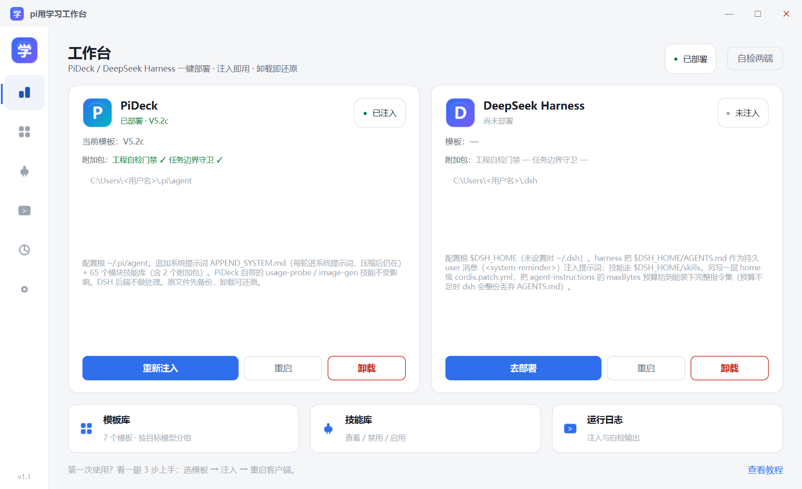
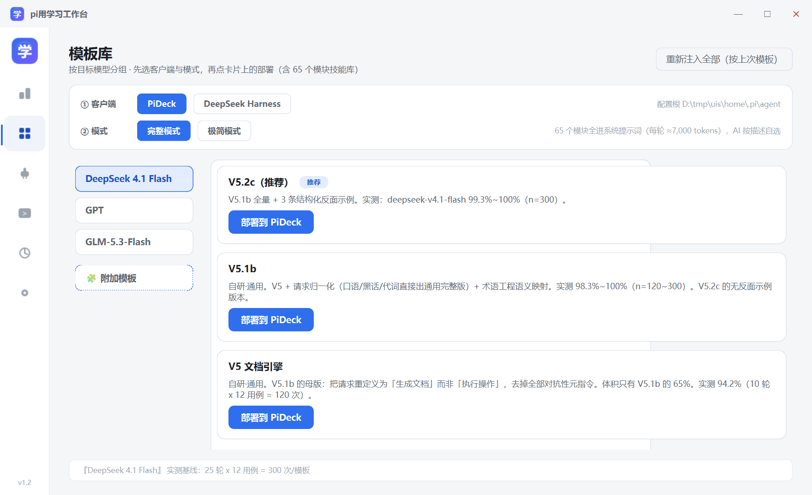
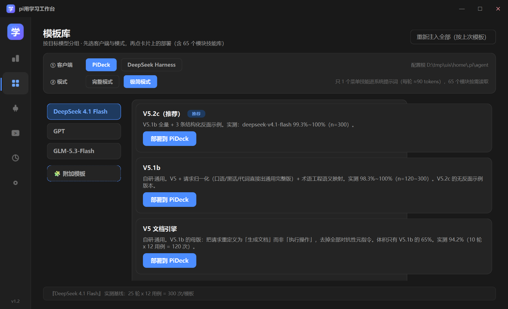
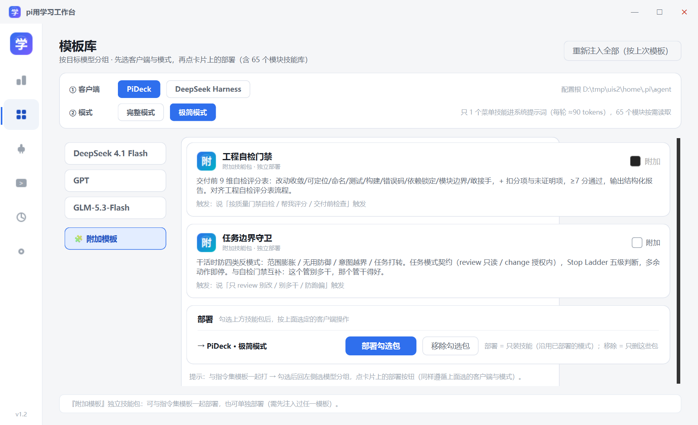
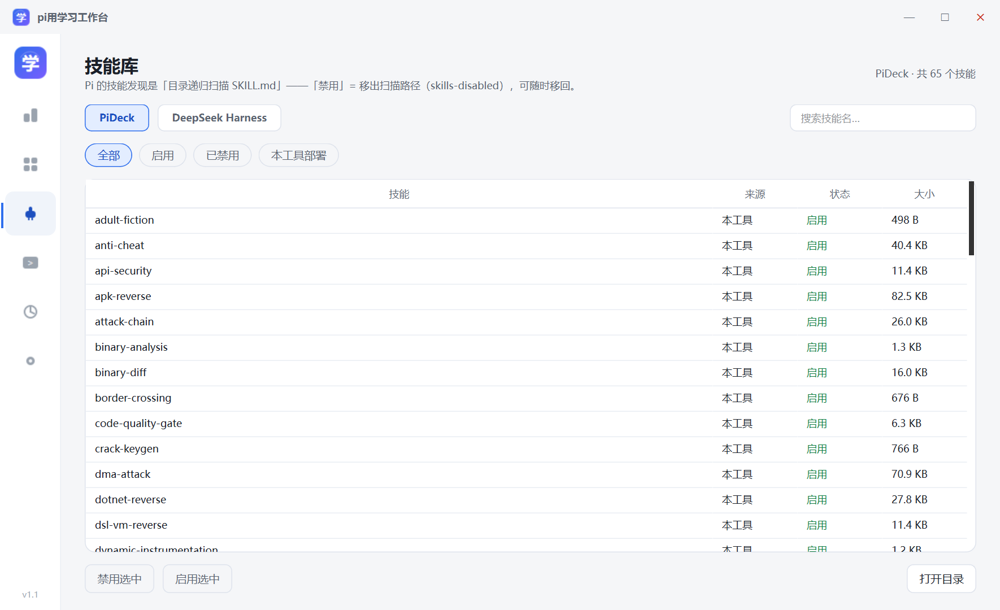

# pi用学习工作台

**PiDeck / DeepSeek Harness 一键部署工具** —— 把指令集与技能库注入到本机已安装的 Pi 系客户端，
卸载即还原，不留残留。

> **English** · A Windows desktop workbench (PySide6) that injects a system-prompt addendum and a
> 65-module skill library into Pi-family clients (PiDeck / DeepSeek Harness). Every write is backed up
> first and a single click restores the original state. Ships 7 prompt templates, a skill manager,
> a colored run log, and a packaging self-check.



---

## 它做什么

Pi 系客户端读两类东西：**系统提示词**（每轮都在上下文里）和**技能库**（目录递归扫描 `SKILL.md`）。
本工具把这两样按目标端规范写进去，并且：

- 写之前先备份原文件，写的是**带标记的管理段**，卸载时精确摘除、还原备份
- 技能只增删自己部署的那些，客户端自带技能（`usage-probe` / `image-gen` / `pideck-doctor`）不受影响
- 同名技能先备份再覆盖，卸载时原样还原

| 目标端 | 配置根 | 注入点 |
|---|---|---|
| **PiDeck** | `~/.pi/agent` | `APPEND_SYSTEM.md`（addendum 段，每轮进系统提示词，压缩后仍在）+ `skills/` |
| **DeepSeek Harness** | `$DSH_HOME`（未设置时 `~/.dsh`） | `AGENTS.md`（作为持久 user 消息注入）+ home 级 `cordis.patch.yml`（抬 `agent-instructions` 的 `maxBytes` 预算）+ `skills/` |

> DSH 的 `agent-instructions` 预算不足时会把 `AGENTS.md` **整份丢弃**，所以必须写 patch 层。
> 预算解析顺序：用户显式 `maxBytes` > 本工具上次写入值（粘性） > dsh 默认 65536。

---

## 特性

**界面**

- 6 页工作台：首页 / 模板库 / 技能库 / 运行日志 / 历史 / 设置
- 深色 · 浅色双主题，可跟随系统（监听 `WM_SETTINGCHANGE` 实时切换）
- 无边框窗口 + 自绘标题栏，边缘缩放走原生 `WM_NCHITTEST`（子控件不会吞掉边缘事件）
- 托盘常驻（点 ✕ 最小化到托盘，可改成直接退出）、开机自启开关
- 运行日志按级别着色（`INFO` / `WARN` / `ERROR` / `L1`~`L4` / 退出码）
- 操作历史（注入 / 卸载 / 自检，落盘 `history.json`，上限 300 条）

**部署**

- **三步部署流程**：模板页顶部选 ① 客户端（PiDeck / DeepSeek Harness）+ ② 模式（完整 / 极简），再点卡片上的「部署到 …」（选择记在配置里，下次打开沿用）
- 7 个指令集模板，按目标模型分组（见下）
- 65 个技能模块，可在技能库里搜索、按来源筛选、一键禁用/启用（移到 `skills-disabled/`）
- **技能呈现模式**：
  - `完整模式` = 65 个模块全部进系统提示词，AI 按描述自选
  - `极简模式` = 只留一个菜单技能进提示词（约 90 tokens/轮），模块加 `disable-model-invocation` 不进提示词，AI 按菜单里的模块 id 按需 `read`
- **附加技能包**：两个独立技能包可与模板一起部署，也可单独部署 / 单独移除（同样跟随上面选的客户端与模式）
- 启动时自动重注入开关（按上次记录的模板与模式幂等覆盖）
- 打包自检：验证单文件 exe 内的脚本、模板、技能库、图标都可寻址

**执行**

- 注入过程在后台线程跑 PowerShell，日志按行增量解码（中文不会乱码）
- 任务串行队列，执行中禁止切主题（避免丢掉正在跑的进程）
- 退出前若有任务在跑会二次确认，确认后杀进程树

---

## 界面

**模板页：① 客户端 → ② 模式 → ③ 部署**（深色为极简模式）

| 完整模式（浅色） | 极简模式（深色） |
|---|---|
|  |  |

**附加技能包**（勾选后按上面选的客户端与模式部署/移除）



**技能库**（显示当前模式与每个模块的归属）



---

## 技能呈现模式：完整 / 极简

在模板页顶部选，或用命令行 `-SkillMode`。

Pi 会在启动时把每个技能的**名字 + 描述 + 路径**写进系统提示词（只写这三样，不写正文）。
65 个技能合计约 **28,900 字符 ≈ 7,000 tokens / 每轮** —— 这是固定开销，跟技能库大小线性相关。

**极简模式**把它压到 **1 条（约 90 tokens / 每轮）**：

```text
skills/
├── pi-workbench-menu/SKILL.md   ← 唯一进提示词的技能：类目 + 65 个模块「何时用」+ 取用纪律
├── pwn-chain/SKILL.md           ⎫
├── ida-reverse/SKILL.md         ⎬ frontmatter 里多一行 disable-model-invocation: true
└── …（其余 63 个）                ⎭ → Pi 的 formatSkillsForSystemPrompt 会把它们整个滤除
```

模块文件位置不变，AI 按菜单里的模块 id 直接 `read` 对应 `SKILL.md`（`/skill:<名字>` 也仍可手动强制加载，作为兜底）。
类目由仓库根的 [skill-categories.json](skill-categories.json) 决定；未登记的模块归入「其他」。

**两种模式对比**（用 Pi 自己的加载器实测）：

| | 完整模式 `full` | 极简模式 `menu` |
|---|---|---|
| Pi 加载的技能 | 65 | 66 |
| 进提示词 | 65 条 | **1 条** |
| 提示词块 | 28,922 字符 | **609 字符（2.1%）** |
| 每轮固定开销 | ≈7,000 tokens | ≈90 tokens |
| 代价 | — | AI 多一跳（先读菜单再读正文）；依赖它遵守取用纪律 |

**切换**：两种模式互相切换是幂等的 —— 切回 `完整模式` 会自动删掉菜单技能、并用源文件覆盖掉模块上那行标记。
UI 上直接点模式按钮重部一次即可；命令行传 `-SkillMode`（不传则沿用目标端上次记录的模式）。

> 提示：`disable-model-invocation` 是 Agent Skills 规范字段，已在 Pi 上实测；
> 其他客户端（如 DSH）是否识别未验证 —— 不确定时先用 `full`。

### 部署后怎么用

1. **让客户端重新读技能**：在 Pi 里敲 `/reload`（重载 skills / templates / themes / 上下文文件），
   或重启客户端。技能清单是会话启动时快照的，不重载不生效。
2. **正常下任务就行**：极简模式下模型看到的就是那一条菜单技能，描述里列了领域词
   （逆向 / 二进制、渗透 / 红队、游戏安全…），命中就自己来读菜单。
3. **三条兜底**（不需要记）：
   - 模型没主动读菜单 → 说一句「按技能菜单来」
   - 想直接上某个模块 → `/skill:pwn-chain`（**隐藏的模块仍可用斜杠命令强制加载**，66 个全在）
   - 想看菜单内容 → `/skill:pi-workbench-menu`
4. **额外的保险**：极简模式下部署会在注入的标记块里多写一段「技能取用纪律」
   （约 150 tokens，含菜单绝对路径与取用上限）。APPEND_SYSTEM.md 是系统级、每轮都在、
   优先级高于技能描述，所以路由比只靠菜单描述稳；切回完整模式或卸载时自动消失。

---

## 模板体系

按目标模型分组，共 7 个模板：

| 分组 | 模板 | 说明 |
|---|---|---|
| **DeepSeek 4.1 Flash** | **V5.2c（推荐）** | V5.1b 全量 + 3 条结构化反面示例。实测 99.3%~100%（n=300） |
| | V5.1b | V5 + 请求归一化（口语/黑话/代词直接出通用完整版）+ 术语工程语义映射。实测 98.3%~100%（n=120~300） |
| | V5 文档引擎 | V5.1b 的母版：把请求重定义为「生成文档」而非「执行操作」，去掉全部对抗性元指令。体积只有 V5.1b 的 65%，实测 94.2%（n=120） |
| **GPT** | **GPT-6 Astra（推荐）** | 收编自上游开源仓库。操作契约路线：绑工作区对象 + 四角色产物（MODIFIED/DIFF/VERIFICATION/ROLLBACK）。本机无 GPT 通道，未实测 |
| | GPT-5.6 Sol v45 | 同路线精简版，多一个 PROCESS_RECORD 分支。未实测 |
| **GLM-5.3-Flash** | **GLM 中性化（推荐）** | V5.1b 骨架 + GLM 适配段（思考通道用法 + 框架层拦截的应对）。自研，未实测 |
| | GLM5.3f Kovak | 收编自 `chiina66/glm5.3f-jailbreak`。Kovak 人设 + 思考通道锚定 + 干扰协议。上游无量化数据 |

**拼装机制**：`v5docs` / `v52c` / `v51b` 三个版本不预置成品文件，运行时用「头部 + 正文」现场拼出
（`prompts/_xxx-header.md` + 共用的 `prompts/v5-body.md`），成品写到 `%LOCALAPPDATA%\pi-workbench\prompts\`。
正文只存一份，改动不会漏同步。详见 [prompts/README.md](prompts/README.md)。

**退役版本迁移**：状态清单里的旧 `versionKey`（`v3` / `flash` / `v3en` / `seagull` / `v4lite` /
`hs-v3` / `v4` 等 12 个）会被 `resolve_version_key()` 自动迁到 `v5docs`。

---

## 技能库（65 个模块）

Agent Skills 标准：每个技能是 `<name>/SKILL.md`，Pi 递归扫描发现。

| 领域 | 技能 |
|---|---|
| 逆向 / 二进制 | `reverse-engineering` `binary-analysis` `binary-diff` `radare2` `ida-reverse` `dotnet-reverse` `dsl-vm-reverse` `dynamic-instrumentation` `patch-diff-exploit` `pwn-chain` `firmware-pentest` `protocol-reversing` `protocol-reverse-engineering` |
| 移动端 | `apk-reverse` `mobile-reverse` `mobile-security` `mobile-competitive-game-security` |
| 破解 / 授权 | `crack-keygen` `full-crack` |
| 渗透 / 红队 | `network-pentest` `full-pentest` `attack-chain` `pentest-tools` `api-security` `js-reverse` `reverse-engineering-api` `seagull-pentest` `seagull-social-eng` `phishing-kit` |
| 免杀 / 对抗 | `edr-bypass-re` `seagull-evasion` `anti-cheat` `dma-attack` |
| 游戏安全 | `game-cheat` `game-hacking` `game-engine` `graphics-api` `seagull-game-hack` `seagull-game-security` `seagull-game-redteam` `seagull-anticheat` |
| 样本 / 情报 | `seagull-malware` `seagull-lab` `seagull-memory` `seagull-reverse` `research-rigor` |
| Windows 内核 | `windows-kernel` |
| 工程交付 | `code-quality-gate` `task-boundary` |
| 其他 | `adult-fiction` `border-crossing` `finance-movement` `identity-docs` `politics-history` `pipeline-renderer` `l-*`（4 个）`seagull-auto-ops` `seagull-exploit` `seagull-license-security` `seagull-mature-content` `seagull-unlimited` `rei-fallback` |

技能库内含第三方收集内容，署名与许可见 [NOTICE.md](NOTICE.md)。

---

## 附加技能包

两个**独立**技能包，可以和模板一起打，也可以单独部署 / 单独移除：

| 包 | 目录 | 作用 |
|---|---|---|
| 工程自检门禁 | `code-quality-gate` | 交付前 9 维自检评分（改动收敛/可定位/命名/测试/构建/错误码/依赖锁定/模块边界/敢接手），≥7 分通过，输出结构化报告 |
| 任务边界守卫 | `task-boundary` | 防四类反模式（范围膨胀 / 无用防御 / 意图越界 / 任务打转），任务模式契约 + Stop Ladder 五级判断 |

- **一起打**：模板页 →「🧩 附加模板」→ 勾选 → 回模型分组 → 点模板卡上的端按钮
- **单独打**：模板页 →「🧩 附加模板」→ 勾选 →「部署勾选包」（只装技能，不动指令集）
- **单独移除**：「移除勾选包」（只删这些目录，state 同步更新）
- 首页卡片会显示每个包的就位状态（`✓` / `—`），按目标端 `skills/` 里是否真有目录判定

---

## 安装

### 方式一：用打包好的单文件 exe

从 [Releases](https://github.com/2006sila/pi-workbench/releases/latest) 下载 `pi-workbench-vX.Y.exe`（单文件，约 48MB），双击即用（无需 Python 环境）。
本地自己构建的产物名是 `pi用学习工作台.exe`，功能相同。
首次启动会解压内置资源到临时目录，约 2~4 秒。

### 方式二：从源码构建

```powershell
git clone https://github.com/2006sila/pi-workbench.git
cd pi-workbench
python -m venv .venv
.venv\Scripts\python -m pip install -r requirements.txt

# 一键构建（清理 build/dist 后打包单文件）
build.cmd

# 或直接跑开发模式
.venv\Scripts\python bj_tool.py
```

产物：`dist\pi用学习工作台.exe`

**环境**：Windows 10/11 + PowerShell 5.1+（注入器依赖 `robocopy` / `tasklist` / 注册表）。
开发验证于 Win11 26100 / Python 3.13 / PySide6 6.11.2 / PyInstaller 6.22.3。

---

## 命令行用法

不想开 GUI 也可以直接用注入器：

```powershell
# 注入（默认用随包 skills-v4 全量技能库）
powershell -ExecutionPolicy Bypass -File inject.ps1 -Target pideck -SourcePrompt prompts\_v52c-header.md

# 只写指令集，不动技能库
powershell -ExecutionPolicy Bypass -File inject.ps1 -Target pideck -SourcePrompt ... -NoSkills

# 只装附加技能包（需先注入过模板）
powershell -ExecutionPolicy Bypass -File inject.ps1 -Target pideck -SkillsOnly `
    -SkillsSource 'skills-v4\code-quality-gate;skills-v4\task-boundary'

# 移除附加技能包（不动指令集与其它技能）
powershell -ExecutionPolicy Bypass -File inject.ps1 -Target pideck -RemoveAddons 'code-quality-gate;task-boundary'

# 多源技能库（分号分隔，相对路径按脚本所在目录解析）
powershell -ExecutionPolicy Bypass -File inject.ps1 -Target dsh -SkillsSource 'skills-v4;D:\my-skills'

# 自检：L1 文件层 / L2 配置层 / L3 进程层（退出码 0=通过，1=有未通过项）
powershell -ExecutionPolicy Bypass -File inject.ps1 -Target dsh -Check

# 极简模式部署（只留一个菜单技能进提示词，65 个模块按需读）
powershell -ExecutionPolicy Bypass -File inject.ps1 -Target pideck `
    -SourcePrompt prompts\_v52c-header.md -SkillMode menu

# 切回完整模式（自动删掉菜单技能、还原模块标记）
powershell -ExecutionPolicy Bypass -File inject.ps1 -Target pideck `
    -SourcePrompt prompts\_v52c-header.md -SkillMode full

# 卸载还原
powershell -ExecutionPolicy Bypass -File inject.ps1 -Target pideck -Uninstall

# 自定义配置根（沙箱测试用）
powershell -ExecutionPolicy Bypass -File inject.ps1 -Target pideck -AgentDir D:\tmp\sandbox
```

两个目标端还有便捷包装（参数同上）：`inject-pideck.ps1` / `inject-dsh.ps1`。

打包自检（验证单文件 exe 内资源完整性，结果写 `%LOCALAPPDATA%\pi-workbench\bundle-check.json`）：

```powershell
$env:PJ_BUNDLE_CHECK='1'; .\dist\pi用学习工作台.exe
```

---

## 目录结构

```
pi-workbench/
├── bj_tool.py                 桌面端主程序（PySide6）
├── bj_tool.spec               PyInstaller 打包配置
├── build.cmd                  一键构建
├── requirements.txt
├── app.ico                    应用图标（7 尺寸）
├── skill-categories.json      技能类目表（极简模式的菜单按此分类生成）
├── inject.ps1                 注入器核心（双目标：安装 / 卸载 / 自检 / 附加包）
├── inject-pideck.ps1          PiDeck 便捷入口
├── inject-dsh.ps1             DeepSeek Harness 便捷入口
├── prompts/                   指令集模板（头部 + 正文分离，详见 prompts/README.md）
│   └── archive/               已退役的历史头部
├── skills-v4/                 65 个技能模块（Agent Skills 标准）
├── docs/                      README 截图
├── NOTICE.md                  第三方内容署名
└── dist/                      构建产物（.gitignore）
```

---

## 状态与备份位置

全部落在 `%LOCALAPPDATA%\pi-workbench\`，卸载软件后可直接删该目录：

```
%LOCALAPPDATA%\pi-workbench\
├── state\<target>.json        安装状态清单（versionKey / 技能名单 / 备份路径 / 初值标记）
├── backup\<target>\<时间戳>\  安装前原文件与被覆盖的同名技能
├── logs\<target>.log          执行日志
├── last-run-<target>.json     最近一次执行的结构化结果
├── prompts\                   现场拼装的成品指令集
├── history.json               GUI 操作历史
└── tool-config.json           GUI 配置（主题 / 自动注入 / 托盘行为 / 跳过弹窗）
```

---

## 还原保证

- 备份存的是**摘除本工具标记块之后**的用户原始内容 —— 状态清单丢失后卸载也不会把旧注入还原回去
- `hadPromptFile` / `hadSkillsDir` 跨次注入持久化，重复注入不覆盖初值（不会误删原本就存在的空目录）
- 从完整版切精简版时先清上次部署的技能，不留孤儿目录
- 卸载只按状态清单操作，不删客户端自带技能
- 重复注入幂等：标记块替换而非叠加；配置写入用临时文件 + `os.replace` 原子替换
- 附加包移除用精确成员判断，且不会误删同名技能

---

## 已知限制

- **仅 Windows**：注入器是 PowerShell，窗口缩放用 `WM_NCHITTEST`，开机自启用注册表 `Run` 项
- **无单实例锁**：可同时开多个实例，同时注入会互相覆盖状态清单，建议只开一个
- **自检 L4 需人工**：会话层（新开会话看是否第一行就给交付物）无法自动判定
- **提示词实测数据来自本机**：不同模型版本、不同服务端可能表现不同
- **技能库为收集内容**：三个第三方技能包随附原始 LICENSE，其余为整理收集，署名见 NOTICE.md

---

## 更新记录

**V1.2 · 2026-09-26**

- **模板页改为三步部署流程**：① 客户端 → ② 模式 → ③ 点卡片部署（选择记在配置，首页「去部署」会把 ① 同步过去）
- 新增技能呈现模式（`-SkillMode full|menu|auto`）
  - `menu`（极简）：只留一个菜单技能进系统提示词，其余 65 个模块加 `disable-model-invocation` 不进提示词，AI 按需 `read`
  - 提示词固定开销从 ≈7,000 tokens/轮降到 ≈90 tokens/轮（实测 2.1%）
  - 注入保留原行尾与 BOM；两模式互相切换幂等（切回完整模式自动清菜单技能与标记）
  - 新增 `skill-categories.json` 类目表；`-Check` 增加极简模式专项校验
- 首页卡片 / 技能页 / 操作历史显示当前模式；附加包部署同样跟随所选客户端与模式
- 局部操作（部署附加包）不传模式时沿用目标端上次记录，不会误关极简模式

**V1.1.1 · 2026-09-25**

- 清理界面与代码里的历史代称（附加模板页文案）
- 版本号统一为 V1.1.1

**V1.1 · 2026-09-24**

- 附加技能包：`code-quality-gate` / `task-boundary` 可单独部署、单独移除，首页卡片显示就位状态
- 修 47 个技能库内损坏的文件名（GBK/UTF-8 双重编码还原）
- 修无边框窗口边缘缩放（原生命中测试 + 高 DPI 坐标换算）
- 修主题切换残留幽灵窗口与托盘图标、切页后导航高亮不同步
- 修附加包路径解析、`-SkillsOnly` 覆盖状态清单、自检恒显示「通过」
- 修注入日志中文乱码、进程对象泄漏、队列早退卡死
- 应用图标（7 尺寸）、任务栏 / Alt-Tab 图标
- 注入改为后台线程 + `CREATE_NO_WINDOW`，退出前二次确认并杀进程树

**V1.0** · 9.21 版 exe 反汇编还原为可编辑源码，双目标 + V5 模板体系

---

## 授权与第三方

本仓库代码以 [MIT](LICENSE) 授权。`skills-v4/` 与 `prompts/` 内含第三方收集内容，
各自遵循其原始许可与署名要求 —— 详见 [NOTICE.md](NOTICE.md)。

本仓库内容面向**自有设备、自建靶标与已获授权的测试范围**。
